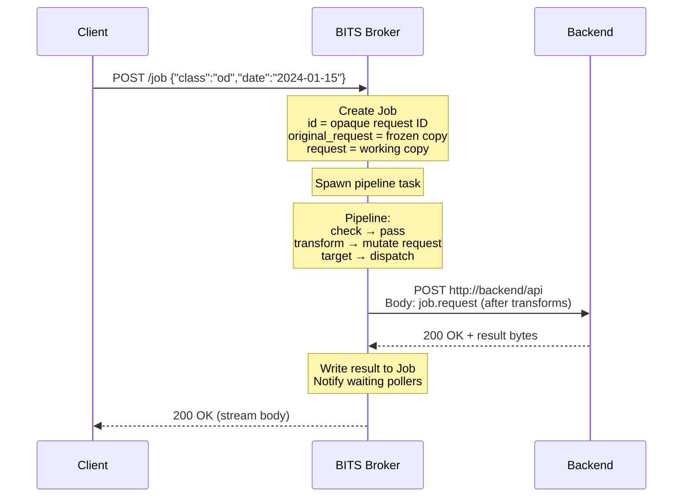
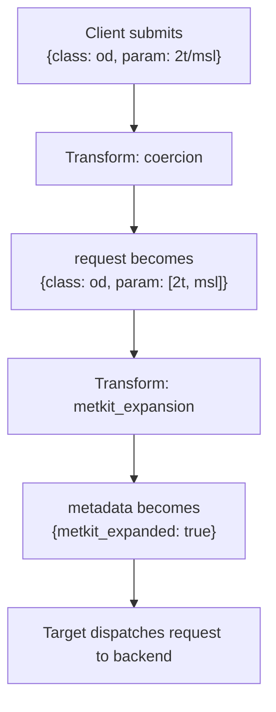
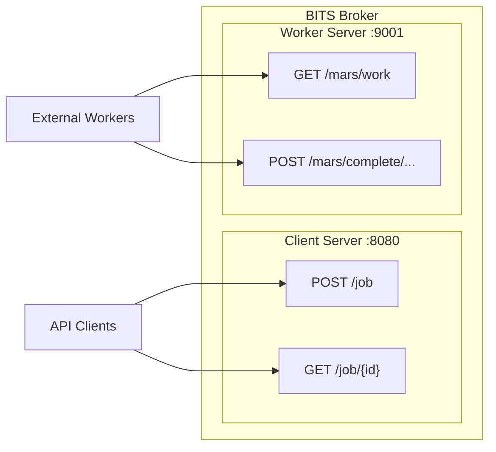
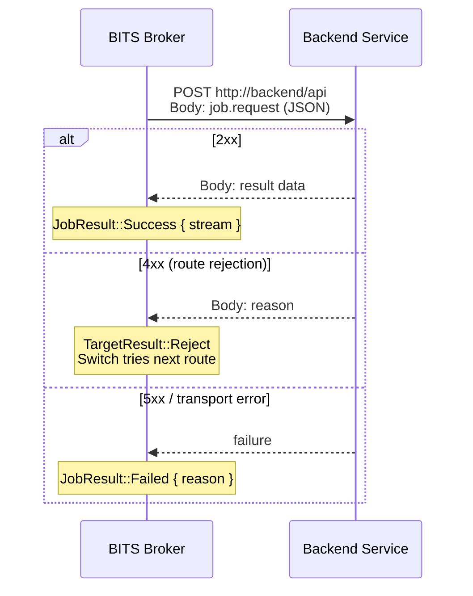
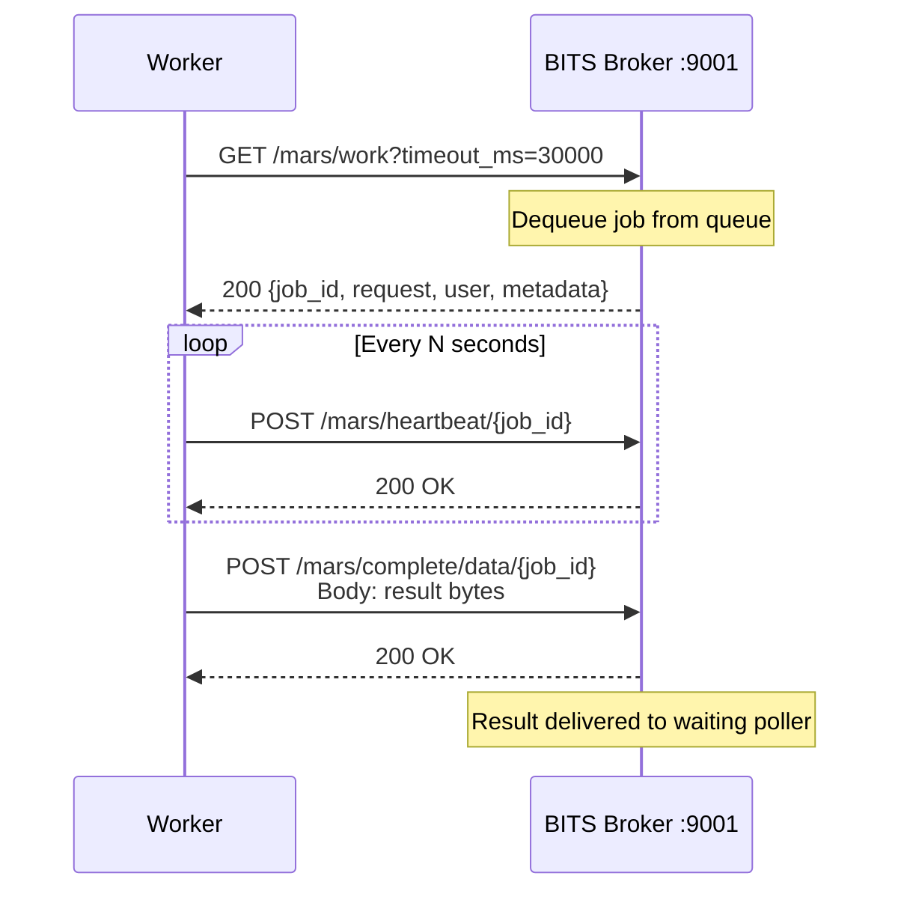
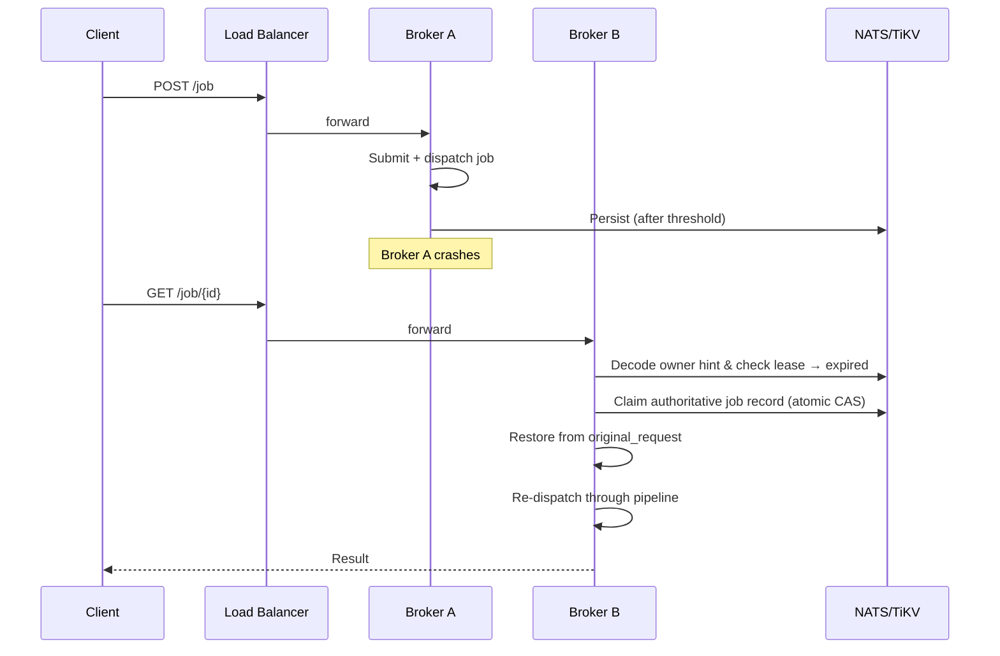
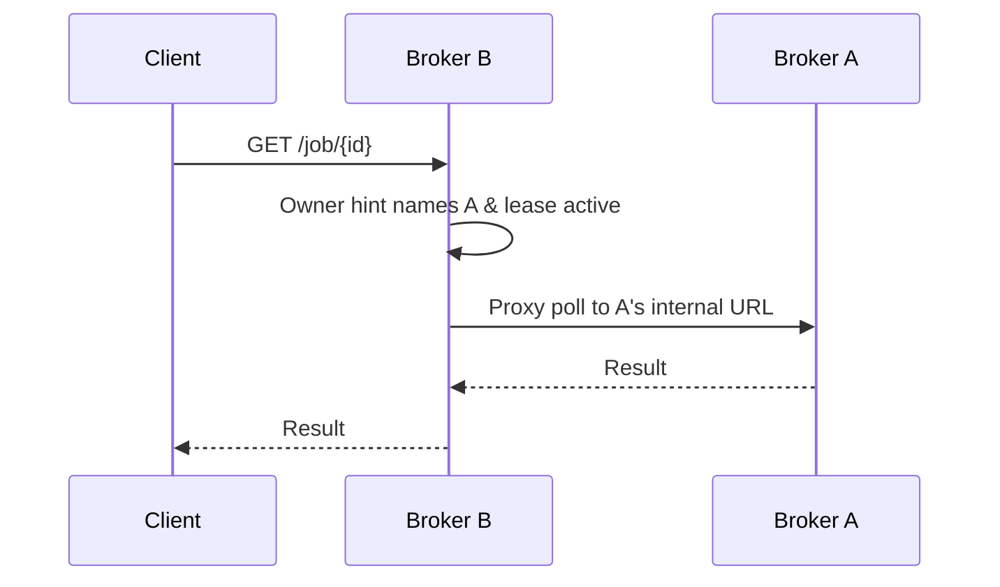
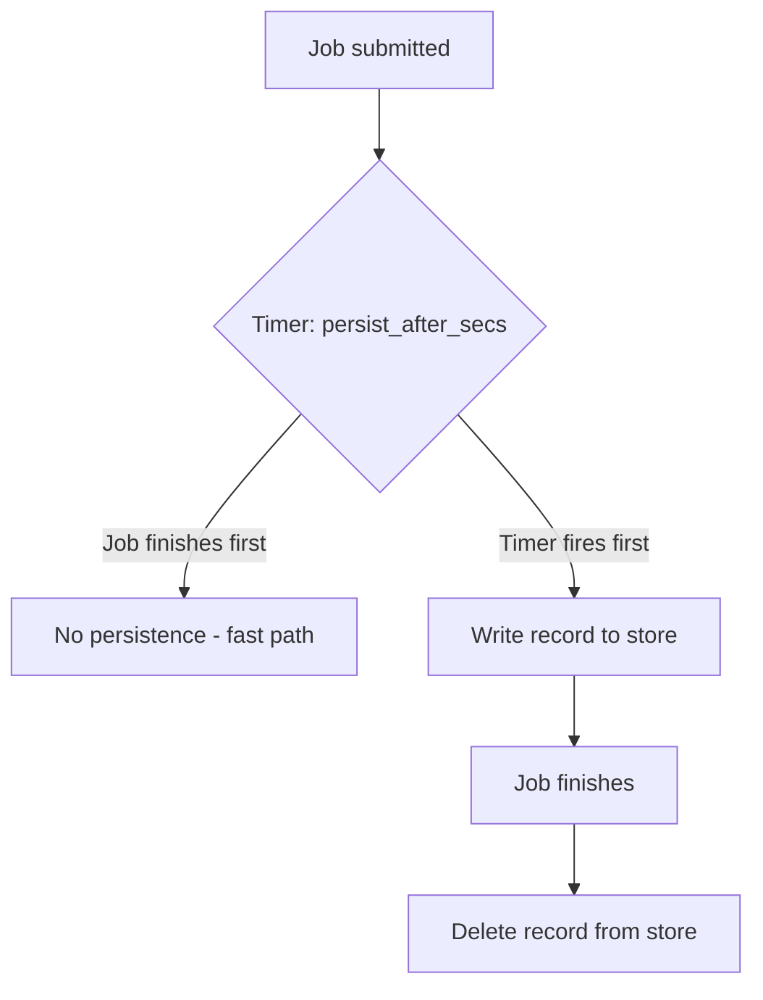
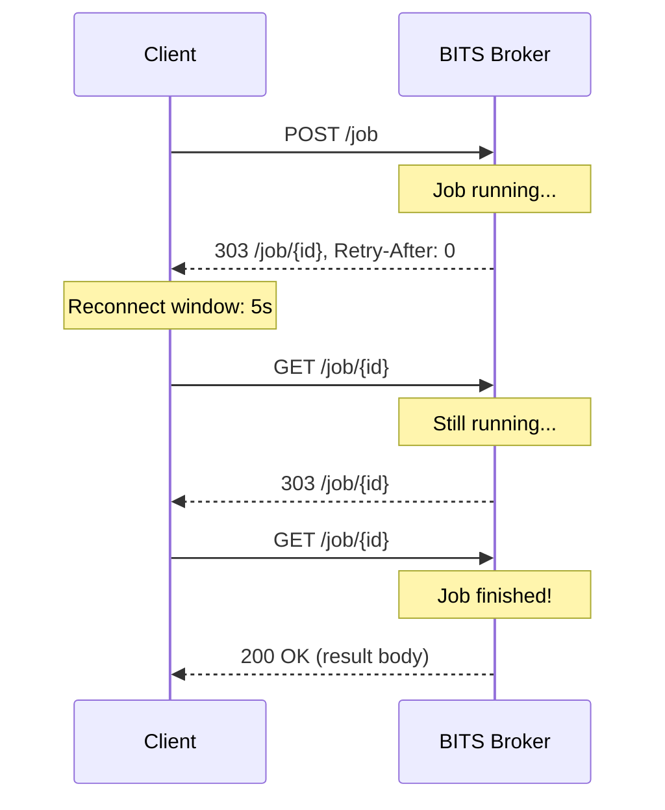

<!--
SPDX-FileCopyrightText: 2026 European Centre for Medium-Range Weather Forecasts (ECMWF)

SPDX-License-Identifier: Apache-2.0
-->

# Data Flow

This page explains how data moves through BITS, from client submission to
backend dispatch and back. Understanding the data flow helps you debug routing
issues, write custom actions, and reason about what each component sees.

## The life of a job

When a client submits a request, BITS creates a Job and routes it through a
pipeline of checks, transforms, and a terminal target:



Key points:

- `submit()` is non-blocking. It creates the Job and spawns a background
  task, returning immediately with a `JobHandle`.
- `poll()` is a long-poll. It waits for the result or times out.
- The pipeline runs in a separate async task from the poll.
- Results are delivered via a shared `Notify`. The poll task sleeps until
  the pipeline writes the result and wakes it.

## What the backend receives

When `target::http` dispatches a job, it takes the job's `request` field and
POSTs it as the JSON body:

```http
POST /api HTTP/1.1
Host: my-backend
Content-Type: application/json

{"class": "od", "date": "2024-01-15"}
```

The request body is exactly `job.request`, the working copy after any
transforms. Nothing is added or wrapped. HTTP headers like `Content-Type`
are set automatically by the HTTP client.

## What transforms do to the data

Transforms can mutate `request`, `metadata`, or both. Each transform in the
pipeline sees the changes from the previous one:



The `original_request` is never touched. It stays as the client submitted
it. This frozen copy is used to restart the job from scratch if the broker
crashes and another broker recovers it.

## Two HTTP servers, two data paths

BITS runs two independent HTTP servers for different audiences:



**Client server** (port 8080): Receives job submissions from end users and
serves poll results. Configured under `server:` in the YAML.

**Worker server** (port 9001): Serves work to external pull-based workers.
Configured under `bits.worker_server:` in the YAML. Only started when
`target::remote` is used.

## Push model: target::http

BITS calls the backend:



A `4xx` from the backend does not immediately fail the job. It becomes a
route rejection. If there are more routes in the switch, the next route is
tried. Only if all routes reject does the client see the rejection.

## Pull model: target::remote

Workers call BITS:



When a worker receives a job, the response body contains:

```json
{
  "job_id": "0217scypcc00000000000000",
  "request": {"class": "od", "param": ["2t", "msl"]},
  "user": {"name": "alice", "group": "research"},
  "metadata": {"cost": 42, "metkit_expanded": true}
}
```

- `request` is the working copy after transforms.
- `user` and `metadata` are passed through as-is.
- `job_id` is used for heartbeats and completion calls.

If the worker stops sending heartbeats, the broker times out the entry and
the job fails. It is not automatically re-queued.

## Multi-broker data flow

When multiple brokers run behind a load balancer, a poll might land on a
different broker than the one processing the job:



If Broker A is still alive, Broker B proxies the poll instead of claiming:



If the proxy fails (A is unreachable but lease hasn't expired), B returns
`Pending` to the client. It does not trigger a reclaim while the lease is
active.

## The persistence threshold

Not all jobs are persisted. Fast jobs stay entirely in memory:



Only `original_request`, `user`, `metadata`, and `created_at` are persisted.
The working `request` (after transforms) is not stored. On recovery, the
job is rebuilt from `original_request` and transforms run again.

## The reconnect window

Between polls, the reconnect window (`bits.reconnect_buffer_secs`, default 5 s) keeps the job alive:



If the client disconnects mid-poll, the `ConnectedGuard` extends the
reconnect deadline automatically. If the client never comes back, the
sweeper eventually removes the completed job from memory.
