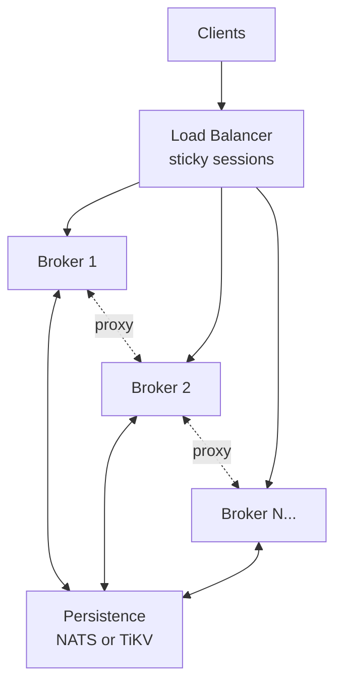

# Deployment

This guide covers production deployment of BITS brokers, from a single instance
to multi-broker clusters with persistence.

## Single broker setup

The simplest deployment runs one broker with no persistence. Jobs exist only
in memory and are lost on restart.

```yaml
server:
  host: "0.0.0.0"
  port: 8080
  poll_timeout_secs: 25.0

bits:
  site: dev
  env: loc

targets:
  backend:
    type: http
    url: "http://backend-service/api"

routes:
  - default:
      - target::backend
```

Start the broker:

```bash
bits-server config.yaml
```

Suitable for development, testing, or stateless workloads where job loss on
restart is acceptable.

## Multi-broker setup

For high availability and horizontal scaling, run multiple brokers behind a
load balancer with a shared persistence backend.



Each broker needs:

1. Compact `bits.site` and `bits.env` tags for request ID generation
2. A reachable `internal_poll_endpoint` for broker-to-broker communication
3. Access to the shared persistence backend

## Persistence backend setup

BITS supports two persistence backends: NATS JetStream KV and TiKV.

### NATS JetStream KV

Build BITS with the `nats` feature enabled.

**Single node (development)**

```yaml
bits:
  site: dev
  env: loc
  internal_poll_endpoint: "http://127.0.0.1:8080/job"
  persist_after_secs: 10.0
  persistence:
    type: nats
    url: "nats://localhost:4222"
    jobs_bucket: "bits-jobs"
    leases_bucket: "bits-leases"
    broker_lease_ttl_secs: 30
    num_replicas: 1
```

**3-node cluster (production)**

Start NATS servers with JetStream enabled:

```bash
# On each node
nats-server -js -cluster_name bits -routes nats://node1:6222,nats://node2:6222,nats://node3:6222
```

Configure BITS with cluster endpoints and replication:

```yaml
bits:
  site: bol
  env: prd
  internal_poll_endpoint: "http://bits-0.bits-headless:8080/job"
  persist_after_secs: 10.0
  persistence:
    type: nats
    url: "nats://nats-0:4222,nats://nats-1:4222,nats://nats-2:4222"
    jobs_bucket: "bits-jobs"
    leases_bucket: "bits-leases"
    broker_lease_ttl_secs: 30
    num_replicas: 3
```

| Field | Description |
|-------|-------------|
| `url` | Comma-separated list of NATS server URLs |
| `num_replicas` | JetStream replication factor. Use 3 for production. |
| `jobs_bucket` | KV bucket name for job records (default: `bits-jobs`) |
| `leases_bucket` | KV bucket name for broker leases (default: `bits-leases`) |
| `broker_lease_ttl_secs` | Lease TTL in seconds (default: 30) |
| `connect_timeout_secs` | Timeout per connection attempt in seconds (default: 10) |
| `init_max_attempts` | Startup retry attempts with exponential backoff (default: 6) |

### TiKV

Build BITS with the `tikv` feature enabled. Requires a TiKV cluster with PD
(Placement Driver).

**PD + TiKV cluster setup**

A minimal production cluster needs:
- 3 PD nodes for consensus and metadata
- 3 TiKV nodes for data storage

```yaml
bits:
  site: bol
  env: prd
  internal_poll_endpoint: "http://bits-0.bits-headless:8080/job"
  persist_after_secs: 10.0
  persistence:
    type: tikv
    endpoints: ["pd-0:2379", "pd-1:2379", "pd-2:2379"]
    broker_lease_ttl_secs: 30
```

| Field | Description |
|-------|-------------|
| `endpoints` | List of PD (Placement Driver) endpoints |
| `broker_lease_ttl_secs` | Lease TTL in seconds (default: 30) |
| `connect_timeout_secs` | Timeout per connection attempt in seconds (default: 10) |

### Choosing a backend

| Consideration | NATS | TiKV |
|---------------|------|------|
| Operational complexity | Lower | Higher |
| Throughput | Excellent | Excellent |
| Latency | Low | Low |
| Existing infrastructure | Good if already using NATS | Good if already using TiDB/TiKV |
| Geographic distribution | Good | Good |

## Load balancer configuration

### Session affinity (sticky routing)

Configure your load balancer to use session affinity based on a stable client
property. Good choices:

- `Authorization` header (hashed)
- Client IP address
- Custom header with user ID

**Why it matters**

Each job is owned by the broker that accepted it. When a poll request arrives
at the owning broker, it returns immediately from local in-memory state. When
a poll arrives at a different broker, BITS must either proxy to the owner or
recover the job from persistence.

Without sticky routing, every poll may hit a different broker, causing:
- Increased latency from proxy calls
- Higher load on the persistence backend
- More complex failure scenarios

**Example: NGINX with IP hash**

```nginx
upstream bits_backend {
    ip_hash;
    server bits-0:8080;
    server bits-1:8080;
    server bits-2:8080;
}

server {
    listen 80;
    location / {
        proxy_pass http://bits_backend;
        proxy_set_header Host $host;
    }
}
```

**Example: HAProxy with header hash**

```haproxy
backend bits_backend
    balance hdr(Authorization)
    hash-type consistent
    server bits-0 bits-0:8080 check
    server bits-1 bits-1:8080 check
    server bits-2 bits-2:8080 check
```

### Health checks

Standard TCP health checks on the HTTP port are sufficient. BITS does not yet
expose dedicated health endpoints, planned for a future release.

## Kubernetes deployment

### Graceful shutdown

BITS handles SIGTERM for graceful shutdown. When a pod receives SIGTERM
(during rolling update or scale-down):

1. The HTTP server stops accepting new connections
2. In-flight requests are allowed to complete
3. The process exits

Configure your container lifecycle:

```yaml
lifecycle:
  preStop:
    exec:
      command: ["/bin/sh", "-c", "sleep 10"]
```

The `preStop` hook gives the load balancer time to remove the pod from its
endpoint list before the SIGTERM is sent.

Set an appropriate termination grace period:

```yaml
terminationGracePeriodSeconds: 60
```

### Resource sizing

**CPU**

- Baseline: 100m (0.1 cores) for light traffic
- Typical: 500m per broker for moderate load
- Heavy: 1-2 cores with thread_pool executors for CPU-bound work

**Memory**

- Baseline: 128Mi
- Typical: 512Mi-1Gi per broker
- Scale with: concurrent job count, dispatcher queue depths

**Example resource limits**

```yaml
resources:
  requests:
    memory: "512Mi"
    cpu: "500m"
  limits:
    memory: "1Gi"
    cpu: "2000m"
```

### Deployment manifest

```yaml
apiVersion: apps/v1
kind: Deployment
metadata:
  name: bits-broker
spec:
  replicas: 3
  selector:
    matchLabels:
      app: bits-broker
  template:
    metadata:
      labels:
        app: bits-broker
    spec:
      terminationGracePeriodSeconds: 60
      containers:
        - name: broker
          image: bits-broker:latest
          args: ["/etc/bits/config.yaml"]
          ports:
            - containerPort: 8080
              name: http
            - containerPort: 9001
              name: worker
          resources:
            requests:
              memory: "512Mi"
              cpu: "500m"
          volumeMounts:
            - name: config
              mountPath: /etc/bits
          lifecycle:
            preStop:
              exec:
                command: ["/bin/sh", "-c", "sleep 10"]
      volumes:
        - name: config
          configMap:
            name: bits-config
---
apiVersion: v1
kind: Service
metadata:
  name: bits-headless
spec:
  selector:
    app: bits-broker
  ports:
    - port: 8080
      name: http
  clusterIP: None
```

The headless service (`clusterIP: None`) gives each pod a stable DNS name
for `internal_poll_endpoint`:

```
bits-0.bits-headless.default.svc.cluster.local
bits-1.bits-headless.default.svc.cluster.local
bits-2.bits-headless.default.svc.cluster.local
```

### Readiness and liveness probes

Dedicated health endpoints are planned but not yet implemented. For now, use
TCP socket checks. If you need HTTP probes, use `GET /job/healthcheck` which
returns a fast `404` without creating a job or long-polling.

```yaml
livenessProbe:
  tcpSocket:
    port: 8080
  initialDelaySeconds: 10
  periodSeconds: 10

readinessProbe:
  tcpSocket:
    port: 8080
  initialDelaySeconds: 5
  periodSeconds: 5
```

## Operator notes

### `internal_poll_endpoint` must be broker-to-broker reachable

The `internal_poll_endpoint` is used by peer brokers to proxy polls. It must
be reachable from all other brokers in the cluster. Common mistakes:

- Using `localhost` or `127.0.0.1`
- Using a load balancer URL that routes back through the LB
- Using an internal IP that changes on pod restart without updating the URL

In Kubernetes, use the headless service DNS name as shown above.

### Worker server (port 9001) is unauthenticated

The remote worker API on port 9001 does not implement authentication. Keep it
internal to your cluster:

- Do not expose port 9001 through the load balancer
- Use network policies to restrict access
- In Kubernetes, do not include port 9001 in the public service

### Backpressure and load shedding

BITS limits how many jobs it keeps in memory so traffic spikes do not turn into
unbounded memory growth. Treat these settings as safety rails for broker memory;
use per-user or per-client rate limiting as the primary way to control load.

| Setting | Scope | Default | Configurable via |
|---------|-------|---------|-----------------|
| Queue capacity | Per action route | 500,000 | `dispatcher.queue_capacity` on each action entry |
| Max jobs | Broker-wide | 500,000 | `bits.max_jobs` |
| Retry-After header | HTTP response | 5s | `server.retry_after_secs` |

When a limit is reached, the broker responds with HTTP 529 (Site Overloaded)
and a `Retry-After` header. The response body includes `"code": "QUEUE_FULL"`
and `"retryable": true`.

Two limits apply to every submission:

- **Per-route queue limit**: each action route has its own waiting queue, capped
  by `dispatcher.queue_capacity`.
- **Broker-wide limit**: the broker also caps the total number of jobs it tracks
  across all routes with `bits.max_jobs`.

A new job is accepted only if **both** limits have room. If either limit is
full, the broker rejects the request.

For example, suppose you have three action routes, each with
`queue_capacity: 100000`, and `bits.max_jobs: 200000`. The broker starts
rejecting new jobs once it is tracking 200,000 jobs in total across all routes,
even if no single route has reached 100,000 jobs yet. If you want multiple
routes to use their full queue capacity at the same time, size `bits.max_jobs`
with that combined load in mind.

`dispatcher.queue_capacity` counts only jobs **waiting** to start for one route.
It does **not** count jobs that are already running. For example, if a route has
`queue_capacity: 1000` and executor `concurrency: 50`, that route can have up
to 1,050 jobs associated with it at once: 1,000 waiting and 50 running.

`bits.max_jobs` is broader. It counts **all** jobs the broker is still tracking
across **all** routes: waiting jobs, running jobs, and completed jobs that have
not yet been polled by clients.

For memory planning, use this rough rule of thumb: each tracked job uses about
500 bytes of broker overhead plus about 2x the request body size. At 500,000
jobs with 5 KB request bodies, plan for roughly 5 GB of memory.

### Timeout defaults

BITS applies default timeouts to all outbound I/O to prevent hung connections
from blocking the broker indefinitely:

| Connection | Default | Configurable via |
|------------|---------|-----------------|
| HTTP targets (`target::http`) | 30s connect + 30s idle-read | `connect_timeout_secs` / `read_timeout_secs` on the target action |
| Internal broker-to-broker proxy | 10s client-level, 2.5s per-request | `internal_poll_timeout_secs` overrides client default |
| TiKV client initialization | 10s per attempt | `connect_timeout_secs` under `bits.persistence` |
| NATS connect + bucket setup | 10s per attempt, 6 attempts | `connect_timeout_secs` / `init_max_attempts` under `bits.persistence` |

NATS initialization is retried at startup with exponential backoff so the
broker tolerates dependency ordering in Kubernetes without entering
CrashLoopBackOff. TiKV connections are lazy (first use, not startup) and
retry automatically on each operation.

HTTP targets enforce idle-read timeouts (maximum gap between response
chunks), not a hard cap on total request or stream duration. Long-lived
streams are allowed as long as data continues flowing within the idle window;
only connections that stall for longer than the configured timeout will fail.

### `persist_after_secs` tuning

Set `persist_after_secs` shorter than your expected job duration but with enough
margin for the persistence write to complete before client polls time out.

Example for 30-second client poll timeout:

```yaml
server:
  poll_timeout_secs: 30.0    # actual client long-poll timeout

bits:
  site: bol
  env: prd
  persist_after_secs: 25.0   # persist after 25 seconds
```

Jobs that complete before `persist_after_secs` never touch the database, keeping
short requests fast.

### `broker_lease_ttl_secs` controls recovery window

When a broker crashes, its jobs remain unrecoverable until the lease expires.
Default is 30 seconds. Tradeoffs:

- Lower TTL (10s): Faster recovery, more heartbeat writes
- Higher TTL (60s): Fewer writes, longer wait after crashes

Tune based on your tolerance for recovery time versus write load.

## Configuration example

Complete production configuration:

```yaml
# =============================================================================
# Server configuration
# =============================================================================
server:
  host: "0.0.0.0"
  port: 8080
  poll_timeout_secs: 30.0
  retry_after_secs: 5            # Retry-After header on 529 overload responses

# =============================================================================
# BITS broker identity and persistence
# =============================================================================
bits:
  # Compact tags encoded into opaque request IDs.
  site: bol
  env: prd

  # Maximum total jobs tracked by this broker (queued + executing + completed).
  # Default 500000. Acts as OOM protection, not load control.
  max_jobs: 500000

  # URL at which peer brokers can reach this instance
  # (auto-derived from server.host/port when omitted)
  internal_poll_endpoint: "http://bits-0.bits-headless:8080/job"

  # How long to wait for internal proxy polls (seconds)
  internal_poll_timeout_secs: 2.5

  # How often to sweep completed jobs from memory (seconds, default 180)
  sweep_interval_secs: 180.0

  # Grace period after client disconnect before sweep eligibility (seconds, default 5)
  reconnect_buffer_secs: 5.0

  # Persist jobs still in-flight after 25 seconds
  persist_after_secs: 25.0

  # Persistence backend: NATS or TiKV
  persistence:
    type: nats
    url: "nats://nats-0:4222,nats://nats-1:4222,nats://nats-2:4222"
    jobs_bucket: "bits-jobs"
    leases_bucket: "bits-leases"
    broker_lease_ttl_secs: 30
    num_replicas: 3
    connect_timeout_secs: 10     # per-attempt connection timeout (default 10)
    init_max_attempts: 6         # startup retry attempts with backoff (default 6)

  # Worker server for remote pools (internal only)
  worker_server:
    host: "0.0.0.0"
    port: 9001

# =============================================================================
# Action registries
# =============================================================================
checks:
  is_privileged:
    type: match
    class: od
    silent: true

transforms:
  expand:
    type: metkit_expansion
    expand_parameters: true

  compute_cost:
    type: cost

targets:
  # Inline HTTP backend
  backend_http:
    type: http
    url: "http://backend-service:8080/api"
    dispatcher:
      queue: cost_weighted
      queue_capacity: 500000     # per-dispatcher queue bound (default 500000)
      executor:
        type: async_pool
        concurrency: 16

  # Remote worker pool
  backend_workers:
    type: remote
    dispatcher:
      queue: fifo
      queue_capacity: 500000
      executor:
        type: remote_pool
        heartbeat_timeout_secs: 60

# =============================================================================
# Routes
# =============================================================================
routes:
  - privileged:
      - check::is_privileged
      - transform::expand
      - transform::compute_cost
      - target::backend_workers

  - default:
      - transform::expand
      - target::backend_http
```

## Validation checklist

Before deploying to production:

- [ ] `bits.site` and `bits.env` are set to 1-3 lowercase letters or digits
- [ ] `internal_poll_endpoint` uses a broker-to-broker reachable address
- [ ] When persistence is enabled: `persist_after_secs + 1s < server.poll_timeout_secs`
- [ ] Load balancer uses session affinity (sticky routing)
- [ ] Worker server port (9001) is not exposed externally
- [ ] Persistence backend is accessible from all brokers
- [ ] For NATS: `num_replicas` matches your cluster size (typically 3)
- [ ] For TiKV: all PD endpoints are listed
- [ ] Resource limits are configured appropriately
- [ ] Backpressure limits (`max_jobs`, `queue_capacity`) are sized for your workload
- [ ] Graceful shutdown is configured (termination grace period, preStop hook)

