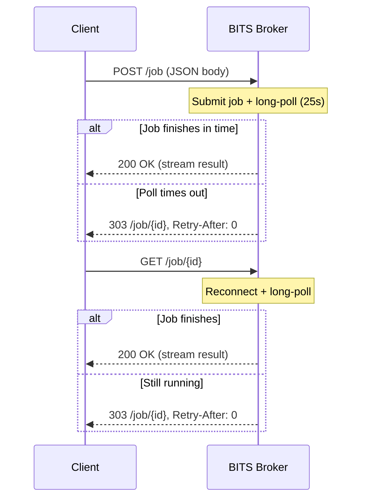
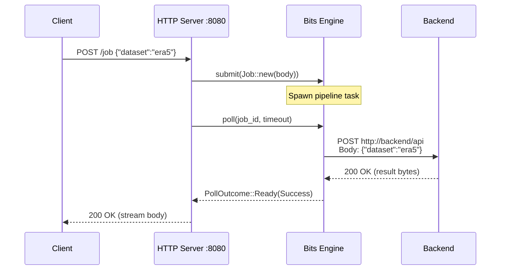

# HTTP Server API

BITS includes a built-in HTTP server for submitting and polling jobs. The server
is started by calling `bits::server::serve()` or
`bits::server::serve_with_shutdown()`.

## Configuration

```yaml
server:
  host: "0.0.0.0"
  port: 8080
  poll_timeout_ms: 25000
```

| Field | Default | Description |
|-------|---------|-------------|
| `host` | `0.0.0.0` | Interface to bind to. |
| `port` | `8080` | TCP port. |
| `poll_timeout_ms` | `25000` | Long-poll timeout in milliseconds. |

## Endpoints

| Method | Path | Description |
|--------|------|-------------|
| `POST` | `/job` | Submit a job and long-poll for the result. |
| `GET` | `/job/{id}` | Reconnect to an existing job and long-poll. |

## Submitting a job

Send the request payload as a JSON body:

```http
POST /job HTTP/1.1
Host: bits-broker:8080
Content-Type: application/json

{"class": "od", "param": "2t/msl", "date": "2024-01-15"}
```

The server creates a `Job` from the JSON body and immediately starts a
long-poll. The JSON body becomes the job's `request` field. Nothing is added
or wrapped.

### If the job finishes within the poll timeout

The result is returned directly. For a successful data response:

```http
HTTP/1.1 200 OK
Content-Type: application/x-grib

...binary data...
```

For a redirect (the backend tells the client to fetch data from another URL):

```http
HTTP/1.1 303 See Other
Location: https://storage.example.com/data/result.grib
```

### If the job is still running

The server returns a pending redirect with the job ID:

```http
HTTP/1.1 303 See Other
Location: /job/broker-1-abc123~def456
Retry-After: 0
```

The client should follow the `Location` to reconnect and continue polling.

## Reconnecting to a job

```http
GET /job/broker-1-abc123~def456 HTTP/1.1
Host: bits-broker:8080
```

This starts another long-poll. The server waits up to `poll_timeout_ms` for
the result. If the job finishes, the result is returned. If not, another
pending redirect is returned and the cycle repeats.

## Connection model



Between polls, BITS keeps the job alive for 5 seconds (the reconnect window).
If the client doesn't come back within that window, the job is eligible for
cleanup by the sweeper. If the client disconnects mid-poll (e.g. network
drop), the reconnect window is extended automatically.

## Response status codes

| Status | Meaning | When |
|--------|---------|------|
| `200 OK` | Success with body. | Job completed with streaming data. |
| `303 See Other` | Follow `Location`. | Redirect to data URL, or pending. |
| `400 Bad Request` | Client error. | Validation failure from backend. |
| `404 Not Found` | Unknown job. | ID doesn't exist or was consumed. |
| `410 Gone` | Job lost. | Cancelled, client disconnected, or owner broker disappeared without durable state. |
| `500 Internal Server Error` | System failure. | Action panicked or routing failed. |

## Data flow

Here's what happens end-to-end when you `POST /job`:



The JSON body you POST is the exact JSON body the backend receives.
Transforms may modify it between submission and dispatch, but the HTTP
server itself adds nothing.

## Graceful shutdown

The server supports graceful shutdown via `serve_with_shutdown()`. On
SIGTERM/SIGINT:

1. The server stops accepting new connections.
2. In-flight requests are drained (existing long-polls complete or timeout).
3. After all requests finish, the server returns.
4. `Bits::drop` runs. The sweeper and heartbeat threads are joined, and the broker
    lease is deleted.

```rust
bits::server::serve_with_shutdown(
    bits,
    server_config,
    bits::server::shutdown_signal(),
).await?;
```
