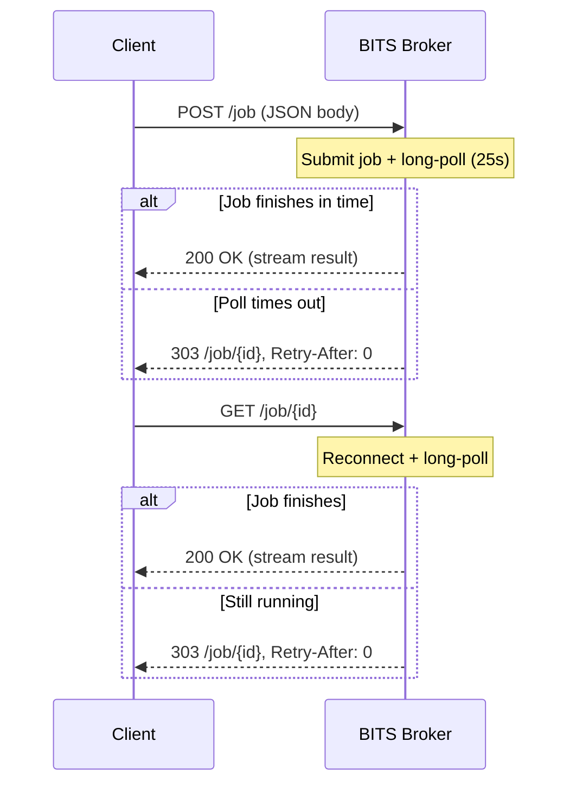
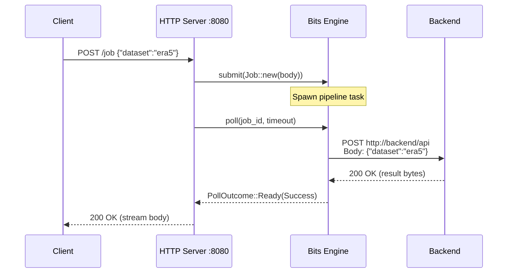

# HTTP Server API

BITS is a library first. The core API (`Bits::submit()`, `Bits::poll()`,
`Bits::cancel()`) is designed for you to embed in your own application and
build whatever HTTP/gRPC/CLI interface makes sense for your use case.

The built-in HTTP server described here is a thin wrapper around that API. It
provides a working submit/poll interface out of the box and serves as a
reference implementation for building your own. The source is in
`bits/src/server.rs`.

The server is started by calling `bits::server::serve()` or
`bits::server::serve_with_shutdown()`.

## Configuration

```yaml
server:
  host: "0.0.0.0"
  port: 8080
  poll_timeout_secs: 25.0
```

| Field | Default | Description |
|-------|---------|-------------|
| `host` | `0.0.0.0` | Interface to bind to. |
| `port` | `8080` | TCP port. |
| `poll_timeout_secs` | `25.0` | Long-poll timeout in seconds. |

## Endpoints

| Method | Path | Description |
|--------|------|-------------|
| `POST` | `/job` | Submit a job (JSON body) and long-poll for the result. |
| `GET` | `/job/{id}` | Reconnect to an existing job and long-poll. |

## Submitting a job

Send the request payload as a JSON body:

```http
POST /job HTTP/1.1
Host: bits-broker:8080
Content-Type: application/json

{"class": "od", "param": "2t/msl", "date": "2024-01-15"}
```

The server creates a `Job` from the JSON body and immediately starts a
long-poll. The JSON body becomes the job's `request` field. Nothing is added
or wrapped.

### If the job finishes within the poll timeout

The result is returned directly. For a successful data response:

```http
HTTP/1.1 200 OK
Content-Type: application/x-grib

...binary data...
```

For a redirect (the backend tells the client to fetch data from another URL):

```http
HTTP/1.1 303 See Other
Location: https://storage.example.com/data/result.grib
```

### If the job is still running

The server returns a pending redirect with the job ID:

```http
HTTP/1.1 303 See Other
Location: /job/0217scypcc00000000000000
Retry-After: 0
```

The client should follow the `Location` to reconnect and continue polling. Treat the job ID as an opaque string.

## Reconnecting to a job

```http
GET /job/0217scypcc00000000000000 HTTP/1.1
Host: bits-broker:8080
```

This starts another long-poll. The server waits up to `poll_timeout_secs` for
the result. If the job finishes, the result is returned. If not, another
pending redirect is returned and the cycle repeats.

## Connection model



Between polls, BITS keeps the job alive for `bits.reconnect_buffer_secs` (default 5 seconds).
If the client doesn't come back within that window, the job is eligible for
cleanup by the sweeper. If the client disconnects mid-poll (e.g. network
drop), the reconnect window is extended automatically.

## Response status codes

| Status | Meaning | When |
|--------|---------|------|
| `200 OK` | Success with body. | Job completed with streaming data. |
| `303 See Other` | Follow `Location`. | Redirect to data URL, or pending. |
| `400 Bad Request` | Client error. | Validation failure from backend. |
| `404 Not Found` | Unknown job. | ID doesn't exist or was consumed. |
| `410 Gone` | Job lost. | Cancelled, client disconnected, or owner broker disappeared without durable state. |
| `500 Internal Server Error` | System failure. | Action panicked or routing failed. |

## Structured error responses

Application-level 4xx/5xx responses from the direct owner broker return a JSON
body with three fields:

```json
{
  "code": "JOB_NOT_FOUND",
  "message": "job does not exist or was already consumed",
  "retryable": false
}
```

| Field | Type | Description |
|-------|------|-------------|
| `code` | string | Stable machine-readable error code. Safe to use in monitoring, alerting, and client-side branching. |
| `message` | string | Human-readable description. May change between releases. |
| `retryable` | boolean | Whether the client should retry the same HTTP request (GET poll or POST submit). Currently `false` for all outcomes. |

### Error codes by status

| Status | Code | When |
|--------|------|------|
| `404` | `JOB_NOT_FOUND` | Job ID doesn't exist or result was already consumed. |
| `410` | `JOB_LOST` | Job existed but owner broker disappeared without durable state. |
| `410` | `ACTION_CANCELLED` | Job was explicitly cancelled. |
| `410` | `ACTION_CLIENT_GONE` | Client disconnected and reconnect window expired. |
| `400` | `JOB_ERROR` | Backend returned a job-level validation error. |
| `500` | `JOB_FAILED` | Action panicked or returned a system-level failure. |

### Two code namespaces

The `code` field uses two naming conventions:

- **`JOB_*` codes** are HTTP-layer codes for poll and result outcomes. They
  exist only in HTTP responses and are defined in `bits::server`.
- **`ACTION_*` codes** bridge the library error system (`ActionError::code()`)
  and the HTTP layer. `ACTION_CANCELLED` and `ACTION_CLIENT_GONE` are the
  same codes used by `BitsError::code()`.

Library-level codes like `CONFIG_YAML_SYNTAX` or `PERSISTENCE_BACKEND` don't
appear in HTTP responses because config and persistence errors happen at
startup, not during job processing.

### What is NOT structured

Success responses (`200 OK`) return the raw streaming body from the backend,
not JSON. Redirect responses (`303 See Other`) return headers only.

Framework-level rejections (malformed JSON body, wrong Content-Type) are
handled by Axum before the handler runs and currently return plain text
errors, not structured JSON.

Proxied responses from a non-owner broker always use the structured JSON
error envelope, but the `code` and `message` fields may differ from the
owner's original response. The proxy maps HTTP status to `PollOutcome` and
back, which is lossy: for example, all `410` responses become
`ACTION_CANCELLED` regardless of the original code, and `500` from the owner
is treated as transient (returned as a pending redirect, not surfaced as
`JOB_FAILED`).

## Data flow

Here's what happens end-to-end when you `POST /job`:



The JSON body you POST is the exact JSON body the backend receives.
Transforms may modify it between submission and dispatch, but the HTTP
server itself adds nothing.

## Graceful shutdown

The server supports graceful shutdown via `serve_with_shutdown()`. On
SIGTERM/SIGINT:

1. The server stops accepting new connections.
2. In-flight requests are drained (existing long-polls complete or timeout).
3. After all requests finish, the server returns.
4. `Bits::drop` runs. The sweeper and heartbeat threads are joined, and the broker
    lease is deleted.

```rust
bits::server::serve_with_shutdown(
    bits,
    server_config,
    bits::server::shutdown_signal(),
).await?;
```
