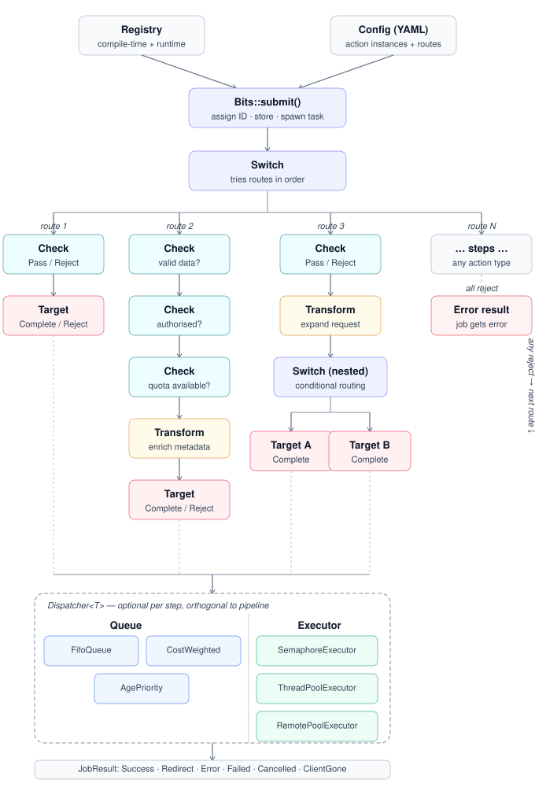

<div align="center">

# BITS

**Broker for Intelligent Task Scheduling**

[](https://github.com/ecmwf/codex/raw/refs/heads/main/Project%20Maturity#sandbox)
[]()
[]()

</div>

> \[!IMPORTANT\]
> This software is **Sandbox** and subject to ECMWF's guidelines on [Software Maturity](https://github.com/ecmwf/codex/raw/refs/heads/main/Project%20Maturity).


> A policy-aware job broker that classifies, transforms, and dispatches requests across distributed infrastructure — with queuing, persistence, and fault recovery built in.

---

## ✨ Features

- ⚡ **Fast and slow requests, one broker** — ephemeral jobs flow through the pipeline in-memory with no overhead; long-lived jobs persist after a configurable in-flight threshold.

- 📡 **Horizontal scalability with consistency** — multiple broker instances share quota of shared resources safely and efficiently.

- 🚦 **Queuing and backpressure** — any pipeline step (check, transform, or target) can have a dispatcher with configurable ordering and concurrency.

- 🔀 **Push and pull targets** — push jobs directly to a target via HTTP, or use `target::remote` to hand off to an external worker pool.

- 💾 **Persistence and recovery** — long-running jobs can be persisted after a configurable in-flight threshold, then reclaimed by live brokers after owner lease expiry.

- 🔌 **Pluggable actions** — additional actions can be created in Rust or Python.


---

## 🚀 Quick Start

Define your routing policy in YAML:

```yaml
bits:
  persist_after_ms: 10000
  poll_timeout_ms: 30000
  persist_guard_ms: 1000

checks:
  is_operational:
    type: match
    class: od

targets:
  backend:
    type: http
    url: "http://my-service/api"
    dispatcher:
      queue: cost_weighted   # order cheap jobs first
      concurrency: 8         # max simultaneous requests

routes:
  default:
    - check::is_operational
    - target::backend
```

Load it and process jobs:

```rust
let bits = Bits::from_config(config)?;

// Submit a job — returns a handle immediately
let handle = bits.submit(Job::new(json!({"class": "od"})));

// Poll for the result (blocks until ready or timeout)
let outcome = bits.poll(&handle.id, Some(Duration::from_secs(30))).await;
```

### Async Python interface

An asyncio-native Python extension is available in the `bits-py` crate.

Build and install it into your current Python environment:

```bash
pip install maturin
maturin develop --manifest-path bits-py/Cargo.toml
```

**Submitting jobs from Python:**

```python
import asyncio
from bits_py import Bits

async def main():
    bits = await Bits.from_config(open("config.yaml").read())
    job_id = await bits.submit({"dataset": "era5", "year": 2020})
    outcome = await bits.poll(job_id, timeout_secs=30.0)
    print(outcome)

asyncio.run(main())
```

**Writing custom actions in Python:**

Register Python action classes before loading the config. Subclass the
appropriate ABC and implement the async method:

```python
from bits_py import (
    Bits, CheckAction, TargetAction,
    Pass, Reject, Success,
    register_action,
)

class HasRole(CheckAction):
    def __init__(self, role: str):
        self.role = role

    async def evaluate(self, job) -> Pass | Reject:
        roles = (job.user or {}).get("roles", [])
        return Pass() if self.role in roles else Reject(f"missing role: {self.role}")

class EchoTarget(TargetAction):
    async def dispatch(self, job) -> Success:
        return Success.json({"echo": job.request})

# Register before from_config
register_action("has_role_py", HasRole)
register_action("echo", EchoTarget)

config = """
checks:
  gate:
    type: has_role_py
    role: admin
targets:
  echo:
    type: echo
routes:
  default:
    - check::gate
    - target::echo
"""

async def main():
    bits = await Bits.from_config(config)
    job_id = await bits.submit({})
    print(await bits.poll(job_id, timeout_secs=5.0))
```

See [Writing Custom Actions](docs/src/custom-actions.md) for the full Python API reference.

---

## 🔀 Programmatic Routes

The `routes` section in YAML is optional. When your application manages its own collection or
tenant model, you can add routes at runtime via `Bits::add_route()`:

```rust
let bits = Bits::from_config(config)?;

// Add a route from a YAML fragment — shared targets use the same Arc
let handle = bits.add_route("my_collection", &route_yaml)?;

// Submit via the named route
let job_handle = handle.submit(Job::new(json!({"class": "od"})));
```

If the route uses `target::remote`, the worker server is started automatically inside
`add_route()` — no extra call is needed.

Routes added this way share registries and target instances with YAML-defined routes. See
[Programmatic Routes](docs/src/configuration.md#programmatic-routes) for details.

---

## 📐 Dispatcher Config

Any step in a pipeline can be given a dispatcher via a `dispatcher:` key. For named registry entries it sits alongside `type:`; for inline steps it is a sibling key of the action mapping:

```yaml
# Named registry entry
targets:
  mars:
    type: http
    url: "http://mars/api"
    dispatcher:
      queue: cost_weighted
      concurrency: 10

# Inline step
routes:
  default:
    - transform::metkit_expansion:
        expand_parameters: true
      dispatcher:
        concurrency: 4
    - target::http:
        url: "http://mars/api"
      dispatcher:
        queue: cost_weighted
        concurrency: 10
```

| Field | Values | Default |
|-------|--------|---------|
| `queue` | `fifo`, `cost_weighted`, `age_priority` | none (FIFO when `concurrency` is set) |
| `executor` | `async_pool`, `thread_pool`, `remote_pool`* | `async_pool` |
| `concurrency` | positive integer | unlimited |

\* `remote_pool` is only valid with `target::remote`.

---

## 🏗 Architecture

<p align="center">
  
</p>

See [design.md](design.md) for the full design specification.

---

## 🧰 Developer hooks

This repo includes a pre-commit configuration that runs rustfmt automatically:

```bash
pip install pre-commit
pre-commit install
```

The hook runs `cargo fmt --all` on each commit.
You can also run it manually:

```bash
pre-commit run --all-files
```
